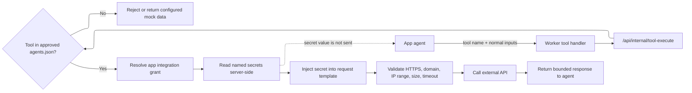

This page centralizes the security and enterprise answers that usually come up
before a team deploys Second beyond local development.

In short: production Second is designed to run inside infrastructure you control
or a dedicated managed environment, use your auth provider, use your OAuth apps,
and keep integration credentials on the server side. Agents can request approved
tools; they do not receive API keys, OAuth client secrets, refresh tokens, or
access tokens.

## Enterprise model

Second has two current deployment shapes:

| Deployment | Best for | Security boundary |
| --- | --- | --- |
| Local CLI | Individual evaluation and local app building | Runs on the user's machine with local data and local secrets |
| Self-hosted or managed instance | Teams and production use | Runs in customer-owned infrastructure or a dedicated managed environment |

Production deployments should use `SECOND_AUTH_MODE=external`, keep web and
worker internal routes on a private network, and use a production secret store
such as WorkOS Vault when configured. Without WorkOS Vault, OAuth secrets
require `SECOND_TOKEN_ENCRYPTION_KEY` so the local encrypted adapter can store
token references safely.

Second is not a hosted OAuth broker. For enterprise deployments, customers bring
their own identity provider, OAuth provider apps, and workspace policies.

<Info>
Need help with secure deployment, production rollout, cost management, runtime
configuration, or support? Contact [sales@second.so](mailto:sales@second.so).
</Info>

## Authentication

Second separates authentication from authorization.

Authentication answers "who is this user?" In production, that answer comes
from your external provider. Your provider is responsible for:

- resolving the authenticated actor on each request
- returning a stable user identifier
- mapping the user into Second's `users` table
- syncing workspace memberships and roles
- handling invitations if collaboration is enabled

Authorization still happens inside Second. Every workspace route proves
membership, checks role permissions where needed, and queries data with
`workspaceId` filters. A valid user from one workspace cannot read another
workspace by guessing IDs.

For the full request guard model, see [Guard and Tenancy](/guard-and-tenancy).

## Customer-owned OAuth apps

OAuth integrations use provider apps owned by the customer. The builder can
describe the OAuth metadata an app needs, but admins configure the real provider
client in Second settings.

For example, a Slack integration should be set up with your own internal Slack
app:

1. Create or open a Slack app in your Slack workspace.
2. Grant only the scopes the generated app needs, such as `chat:write` for a
   tool that posts messages.
3. Install that Slack app into your workspace.
4. Paste the resulting bot token or OAuth client details into Second.
5. Users connect their own accounts when the integration uses user OAuth.

For self-hosted or customer-cloud deployments, Slack API calls go from your
Second deployment to Slack. The Slack credential does not need to pass through a
shared Second SaaS service. In a dedicated managed deployment, the call path is
still limited to that deployment's server-side runtime and its configured
secret store.

OAuth client secrets, refresh tokens, access tokens, and provider token
responses are never sent to the agent runtime.

## agents.json

`agents.json` is the app's proposed agent and tool configuration. It can define
app agents, custom HTTP tools, data tools, integration domains, OAuth metadata,
required scopes, required static secrets, and mock data.

`agents.json` is not trusted just because the builder wrote it. The enterprise
control point is approval:

```text
Builder writes agents.json
  -> present_agents validates and shows the Agents card
  -> admin or owner approves the exact payload
  -> Second stores the canonical JSON hash and approver metadata
  -> runtime can use only that approved payload
```

If `agents.json` changes later, the approval becomes stale. A new domain,
endpoint, OAuth scope, token URL, secret name, permission group, or data
collection must be reviewed again before live tools can use it.

This means the builder can move quickly in draft mode, but the runtime that
touches live integrations is pinned to the configuration an admin or owner
approved.

## Secrets and tool execution

Agents do not get a general "get secret" endpoint. They call named tools. The
server-side tool execution path decides whether that tool is approved and which
secret values, if any, are injected into the outbound HTTP request.



What each layer can see:

| Layer | Can see | Cannot see |
| --- | --- | --- |
| Agent runtime | Tool names, tool descriptions, normal tool inputs, tool result payloads | Static API keys, OAuth client secrets, refresh tokens, access tokens, Vault IDs |
| Worker | The app/run context, approved tool request, and bounded tool result stream | Raw browser cookies or workspace-wide secret inventory |
| Web internal tool route | Approved `agents.json`, app grant, configured secret references, resolved outbound request | Unapproved arbitrary domains or secrets for another app/workspace |
| Secret store | Actual secret material or encrypted references | Agent prompt or app source as part of normal lookup |

Static-secret tools use named placeholders such as
`{{secrets.SLACK_BOT_TOKEN}}`. OAuth tools omit `Authorization` headers; Second
resolves the triggering user from the server-created app-agent run, refreshes
the access token if needed, and injects the bearer token server-side.

## Slack integration example

A Slack notification app might declare a custom tool in `agents.json` that posts
to `https://slack.com/api/chat.postMessage` and references
`{{secrets.SLACK_BOT_TOKEN}}`.

The important enterprise property is **app-scoped credentials**. A Slack token
configured for one app grant is not a workspace-wide ambient credential and does
not silently power other apps.

The secure runtime behavior is:

1. The builder proposes the Slack tool and setup instructions.
2. An admin reviews and approves the agent configuration.
3. An admin creates the internal Slack app and pastes the bot token into Second.
4. The app agent calls `send_slack_message` with a channel and text.
5. `/api/internal/tool-execute` verifies that exact tool and domain were
   approved for this app.
6. The route injects the bot token into the Slack request server-side.
7. The agent receives only the Slack API response, not the token.

If the Slack token is missing, unconfigured, or no longer satisfies the
requested grant, **Second does not borrow a token from another app**.
Static-secret and OAuth tools return configured mock data when the integration
is not set up or the user's account is missing or revoked.

## Workspace and app isolation

Enterprise deployments rely on the same isolation model everywhere:

- Every app, run, integration, credential, connected account, audit event, and
  app-data record is scoped by `workspaceId`.
- App resources are also bound to `appId`; a same-workspace app cannot read
  another app's run or data by guessing IDs.
- Integration grants are app-scoped. A credential configured for one app does
  not silently power another app.
- OAuth connected accounts are user-scoped. A tool call resolves the triggering
  user from the server-created app-agent run, not from agent-provided input.
- Published app viewers use the last approved published snapshot. Builders can
  continue editing drafts without changing the live version.

## Auditability

Workspace audit logs cover governance and setup actions such as role changes,
integration configuration, agent approval, review requests, approvals, and
publishing decisions. Audit events are workspace-scoped and redact secret
values, provider tokens, prompt payloads, source files, cookies, and headers.

See [Audit Logs](/audit-logs) for the event schema and coverage.

## Enterprise checklist

Before production rollout:

- Use `SECOND_AUTH_MODE=external`.
- Connect Second to your identity provider and map workspace roles.
- Keep web and worker internal routes reachable only on the private deployment
  network.
- Configure WorkOS Vault, or set `SECOND_TOKEN_ENCRYPTION_KEY` for encrypted
  local secret references where appropriate.
- Create customer-owned OAuth apps for providers such as Slack, Google, and
  Microsoft.
- Register the exact redirect URI shown by Second for each OAuth provider.
- Require admin or owner review for `agents.json`, integration grants, scopes,
  secrets, and published snapshots.
- Review audit logs after setup and after any integration or agent change.
- For secure rollout help, deployment support, or cost planning, contact
  [sales@second.so](mailto:sales@second.so).

Related pages:

- [Self-hosting](/self-hosting)
- [Authentication](/authentication)
- [App Governance](/app-governance)
- [Integrations](/integrations)
- [Guard and Tenancy](/guard-and-tenancy)
- [Audit Logs](/audit-logs)
