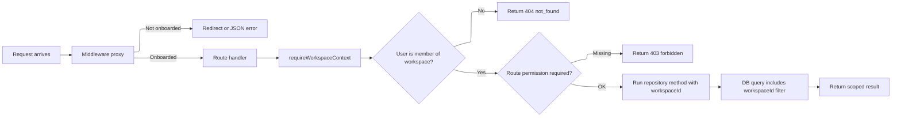

This page explains the security model that prevents one workspace from reading or writing another workspace's data, and keeps app access tied to membership, teams, and app-level permissions.

## Why this matters

In a multi-tenant app, users can know or guess resource IDs. ID secrecy is not a security boundary.

Second treats tenancy as an enforced invariant — every request must prove:

1. **Who** — resolve the actor's identity
2. **Where** — identify which workspace the request targets
3. **Allowed** — verify the actor is a member of that workspace
4. **Permitted** — for sensitive routes, verify a named role permission
5. **Scoped** — execute database queries filtered by `workspaceId`

If identity or onboarding fails, the request gets an auth/onboarding error. If a
workspace/resource is outside the actor's tenant boundary, the request returns
`404`. If the actor is in the workspace but lacks a role permission, the request
returns `403`.

## High-level request flow



## Enforcement layers

There are four layers, from outermost to innermost.

### Layer 1: Middleware proxy (`proxy.ts`)

Runs on every matched request (`/`, `/w/*`, `/onboarding/*`, `/api/*`) before any route handler. Its job is onboarding enforcement and early rejection.

The proxy calls `resolveOnboardingState` and routes based on the result:

| Onboarding state | Page request | API request |
| --- | --- | --- |
| `missing-identity` | Redirect → `/onboarding/identity` | `401 identity_required` |
| `needs-profile` | Redirect → `/onboarding/identity` | `401 profile_required` |
| `needs-workspace` | Redirect → `/onboarding/workspace` | `403 workspace_required` |
| `ready` | Pass through | Pass through |

For fully onboarded users, the proxy also checks:

- **Invalid workspace format** — URL contains a workspace slug that is not URL-safe → API gets `404`, pages pass through to render a not-found page.
- **Membership pre-check** — URL targets a specific workspace → verify the user is a member, otherwise `404`.
- **Onboarding redirect** — onboarded user visits an onboarding page → redirect to `/w/{firstWorkspaceSlug}`.

In `external` auth mode, the proxy skips redirects for page requests (the external provider handles login) but still returns JSON errors for API requests.

### Layer 2: Guard module (`guard.ts`)

Shared logic used by both the middleware and route handlers. Three functions, from lightest to strictest:

| Function | What it does | Used by |
| --- | --- | --- |
| `resolveOnboardingState` | Resolves actor, checks profile completeness and memberships. Returns a discriminated union. | Middleware proxy |
| `requireReadyState` | Calls `resolveOnboardingState`, throws if user isn't fully onboarded. | Routes that need an authenticated user but aren't workspace-scoped |
| `requireWorkspaceContext` | Validates workspace selection, verifies membership, returns full `WorkspaceContext` (actor, user, workspaceId, membership). | Workspace API routes |

Guard failures throw `RequestGuardError` with a typed `code` (`identity_required`, `profile_required`, `workspace_required`, `not_found`) so error responses stay consistent.

### Layer 3: Route handlers

Workspace API routes follow a two-step pattern:

```
const context = requireWorkspaceContext(...)
createAppForWorkspace({ workspaceId: context.workspaceId, ... })
```

The workspace ID for writes always comes from the guard context — never from JSON/form bodies.

Sensitive workspace routes add a role permission check after membership is
proved. For example, integration secret writes require `integrations:manage`,
and member invitation routes require `members:invite`. Roles are fixed today:
owners have full authority, admins can operate workspace settings such as
members and integrations, and members can build/use apps but cannot manage
shared credentials or governance.

Creator and collaborator are not workspace roles. They are app-level access
categories derived from `apps.createdByUserId` and
`apps.collaboratorUserIds`.

Team membership is a narrower layer inside the workspace boundary. Every
workspace has a default `General` team and all current members are assigned to
it. Published app visibility is enforced with team membership: owners and admins
can see every app, app creators and explicit app collaborators can see private
drafts and review requests for that app, and other members can only open
published apps whose `teamIds` overlap their workspace team memberships. Team
IDs and collaborator user IDs supplied by clients are accepted only after they
are validated inside the same `workspaceId`.

Nested routes add parent-resource binding before returning data:

```
const app = findAppById({ workspaceId: context.workspaceId, appId })
const run = loadRunForApp(runId, context.workspaceId, appId)
```

This matters inside a workspace too. A user may legitimately access workspace A, but a run, app-agent run, or file request must still belong to the specific `appId` in the route. Same-workspace cross-app access returns `404`.

Published app access adds a second same-workspace check before nested routes load
files, data, runs, agents, or streams. A member who belongs to workspace A but
not to any team selected for app X receives `404` for app X and every child
resource under it. Admins, owners, app creators, and explicit app collaborators
bypass the team visibility check so they can review or build private apps.
Published runtime files are served from the promoted published source snapshot.
Draft edits update the draft source snapshot only, so team viewers keep using
the last published app while an app creator or collaborator continues building.
Current source snapshots live in `app_source_snapshots`; the hot `apps`
metadata path keeps only snapshot IDs, hashes, file counts, and sizes. Legacy
embedded `sourceFiles` and `publishedSourceFiles` remain readable as a
compatibility fallback, but new writes use the snapshot collection. When an app
creator or collaborator changes an app that is already in review, the pending
review is superseded and the app returns to draft before the edit is accepted.
Review actions against superseded requests are rejected.

Agent configuration has an additional governance check. `agents.json` can be
edited as part of a draft, including by worker file tools, and draft app-agent
runs can start from that draft file. Live custom/data tools still require the
current versioned canonical `agents.json` hash to match an approval recorded by
a workspace admin or owner. The hash canonicalizer is schema-versioned so
non-policy representation changes, such as omitted optional empty arrays, do
not expand or invalidate access. Publishing or review approval promotes that
approved payload with the published snapshot. Internal tool routes then verify
the requested custom tool or data collection is present in the approved payload
for the calling agent.

Integration secrets add one more boundary. A custom tool cannot choose an
arbitrary host at call time: `/api/internal/tool-execute` checks the approved
agent payload, resolves the current app's integration grant by `workspaceId`,
`appId`, provider domain, and key slug, follows that grant's credential binding,
injects only named secrets, and rejects final URLs outside that domain or inside
private network ranges. See [App Governance](/app-governance) and
[Integrations](/integrations).

OAuth connected accounts add a user-specific boundary without trusting the
worker or model to choose the user. OAuth tool execution requires a `runId`; the
web route loads the app-agent run by `{ workspaceId, appId, runId }` and reads
`triggeredByUserId` from that server-created document. Provider config lookup is
scoped by `{ workspaceId, providerKey }`, and connected account lookup is scoped
by `{ workspaceId, userId, providerConfigId }`. A connected account for another
workspace, another app-triggering user, or another provider config cannot satisfy
the tool call.

OAuth authorization and token URLs are not taken from live model input. They
must appear in the approved `agents.json` tool and synced app integration grant,
must match the workspace provider config, must be HTTPS, and must resolve outside
private network ranges before Second redirects or exchanges tokens. Agents never
receive OAuth client secrets, refresh tokens, access tokens, Vault IDs, or token
endpoint responses.

Realtime events do not bypass these checks. Workspace events are Redis
invalidation hints used by mounted clients to refetch compact read models or
update known run status. The data fetch after an event still goes through the
same route-handler authorization and repository scoping described above. Short
settings request dedupe is also scoped by workspace, current user, role, and
membership version, and does not cache a global authorization decision.

### Layer 4: Repositories

The final boundary. Workspace-scoped repository methods require `workspaceId` and include it in every query:

- **List apps:** `find({ workspaceId })`
- **Get app by ID:** `findOne({ _id: appId, workspaceId })`
- **Get builder run by app:** `findOne({ _id: runId, workspaceId, appId })`
- **Get app-agent run by app:** `findOne({ _id: runId, workspaceId, appId })`
- **Get app data:** `find({ workspaceId, appId: scopedAppId, collection })`

Even if a caller has a valid app ID from another workspace, the query returns nothing because `workspaceId` won't match.

## Examples

### Listing apps in your own workspace

`GET /api/workspaces/acme/apps` — user is a member of the `acme` workspace.

1. Guard resolves actor from session/provider.
2. Guard resolves `workspaceId=acme` from route.
3. Membership check confirms actor belongs to `acme`.
4. Repository runs `find({ workspaceId: "acme" })`.
5. Response contains only `acme` workspace apps.

### Fetching another workspace's app by ID

`GET /api/workspaces/acme/apps/<app-id-from-globex>` — user is a member of `acme`, but the app belongs to `globex`.

1. Guard passes membership for workspace `acme`.
2. Repository runs `findOne({ _id: appIdFromGlobex, workspaceId: "acme" })`.
3. No document matches — the app exists in `globex`, not `acme`.
4. API returns `404`. The user learns nothing about whether that app exists elsewhere.

### Creating an app

User submits the form on `/w/acme`:

1. Browser posts to `/api/workspaces/acme/apps`.
2. Guard verifies membership for `acme`.
3. Write path injects `workspaceId=acme` from guard context (not from the request body).
4. App is inserted with `workspaceId=acme`.
5. Response redirects back to `/w/acme`.

### Managing an integration as a member

`PATCH /api/workspaces/acme/integrations/<integration-id>` — user is a member of `acme`
with role `member`.

1. Guard passes membership for workspace `acme`.
2. Route checks `integrations:manage`.
3. `member` does not have that permission.
4. API returns `403`. The resource is in the caller's workspace, but the action
   is not allowed for the caller's role.

## Workspace selection resolution order

When the guard needs to determine which workspace a request targets, it checks these sources in order:

1. Explicit route parameter
2. Path-derived workspace slug
3. Header `x-second-workspace-id`
4. Cookie `second_workspace_id`
5. Fallback to the user's first membership

This keeps the UX smooth (the UI sets the cookie, API clients can use the header) while still enforcing membership before any data access.

If the route path contains an invalid workspace ID format (not a 24-char hex string), the guard returns `404` immediately — it never falls back to header/cookie/default.

## Internal API bypass

Routes under `/api/internal/` are exempted from the middleware proxy. They skip browser session and membership checks because they are called by the worker process, not by a browser. They authenticate via `INTERNAL_API_TOKEN` (Bearer token in the `Authorization` header).

These endpoints are called by the worker process, which has no browser session. The proxy exemption is in `proxy.ts`:

```typescript
if (pathname.startsWith("/api/internal/")) {
  return NextResponse.next();
}
```

Internal endpoints:

| Path | Purpose |
| --- | --- |
| `/api/internal/tool-execute` | Execute custom HTTP tools with secret injection |
| `/api/internal/integration-requirements` | Sync builder-requested integrations, setup steps, permission groups, and secret names |
| `/api/internal/workspace-integrations` | Return current app integration grant metadata to the builder without secret values |
| `/api/internal/agent-run-complete` | Worker callback when an agent finishes |
| `/api/internal/app-data-write` | Agent writes data to app collections |
| `/api/internal/app-data-read` | Agent reads data from app collections |

When `INTERNAL_API_TOKEN` is not set in local development, the auth check is skipped so `npm run dev` works without extra secrets. In production, `INTERNAL_API_TOKEN` is required; the web runtime fails fast if it is missing, and internal endpoints fail closed instead of accepting unauthenticated traffic. Set the same strong token on both web and worker. See [Self-hosting](/self-hosting).

The token only authenticates the worker as an internal caller. Internal
endpoints must still validate tenant scope from the request body, for example
`workspaceId`, scoped app ID, collection, run ID, integration domain, source
version, and the approved `agents.json` payload that grants the requested tool
or data collection.

## Hardening notes

- `SECOND_AUTH_MODE=none` is for local and trusted networks only. See [Authentication](/authentication) for details on external mode.
- Internal API tokens are compared with timing-safe equality.
- Worker HTTP routes, except `/health`, also require `INTERNAL_API_TOKEN` when configured. The web server attaches this token when calling `WORKER_URL`.
- The worker scrubs Second infrastructure secrets from the Claude SDK subprocess environment.
- Custom HTTP tools are domain-locked to the configured integration domain, reject private/internal IPs, and require non-secret input placeholders when the agent provides input. See [Integrations](/integrations#tool-execution).
- Workspace member, invitation, team, app, and integration writes all stay scoped by `workspaceId`; clients do not provide external organization IDs or team IDs for the current invitation flow.
- App preview iframes run without `allow-same-origin`, and bridge handlers only accept `postMessage` events from the expected iframe window.
- For deployment guidance, see [Self-hosting](/self-hosting).
